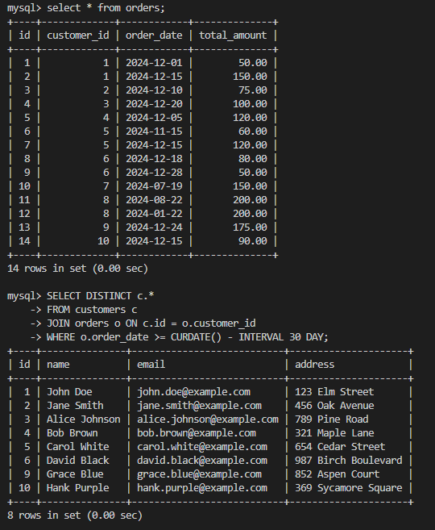
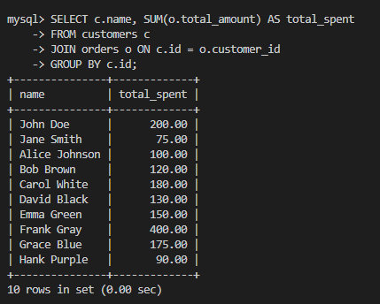
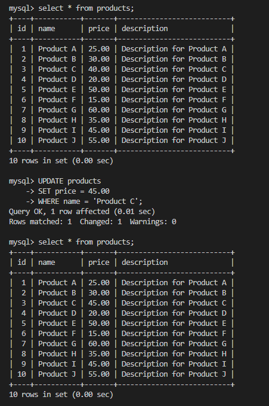
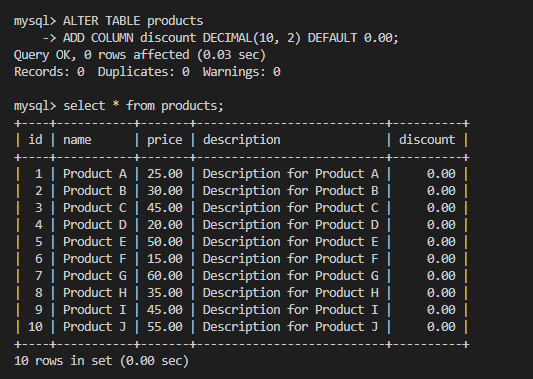
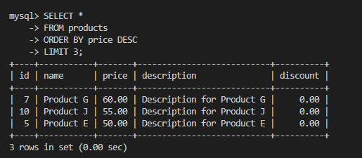

# SQL Task 

1. Create the database

```sql
CREATE DATABASE ecommerce;
```

2. Use the database

```sql
USE ecommerce;
```

3. Create the customers table
 ```sql
CREATE TABLE customers (
    id INT AUTO_INCREMENT PRIMARY KEY,
    name VARCHAR(255) NOT NULL,
    email VARCHAR(255) UNIQUE NOT NULL,
    address TEXT NOT NULL
);
 ```

 


4. Create the orders table

```sql
CREATE TABLE orders (
    id INT AUTO_INCREMENT PRIMARY KEY,
    customer_id INT NOT NULL,
    order_date DATE NOT NULL,
    total_amount DECIMAL(10, 2) NOT NULL,
    FOREIGN KEY (customer_id) REFERENCES customers(id)
);
```


5. Create the products table
```sql
CREATE TABLE products (
    id INT AUTO_INCREMENT PRIMARY KEY,
    name VARCHAR(255) NOT NULL,
    price DECIMAL(10, 2) NOT NULL,
    description TEXT
);
```


6. Insert sample data into the customers table

```sql
INSERT INTO customers (name, email, address)
VALUES
('John Doe', 'john.doe@example.com', '123 Elm Street'),
('Jane Smith', 'jane.smith@example.com', '456 Oak Avenue'),
('Alice Johnson', 'alice.johnson@example.com', '789 Pine Road'),
('Bob Brown', 'bob.brown@example.com', '321 Maple Lane'),
('Carol White', 'carol.white@example.com', '654 Cedar Street'),
('David Black', 'david.black@example.com', '987 Birch Boulevard'),
('Emma Green', 'emma.green@example.com', '159 Spruce Drive'),
('Frank Gray', 'frank.gray@example.com', '753 Willow Way'),
('Grace Blue', 'grace.blue@example.com', '852 Aspen Court'),
('Hank Purple', 'hank.purple@example.com', '369 Sycamore Square');
```

| name          |           email           |       address       |
| ------------- | :-----------------------: | :-----------------: |
| John Doe      |   john.doe@example.com    |   123 Elm Street'   |
| Jane Smith    |  jane.smith@example.com   |   456 Oak Avenue    |
| Alice Johnson | alice.johnson@example.com |    789 Pine Road    |
| Bob Brown     |   bob.brown@example.com   |   321 Maple Lane    |
| Carol White   |  carol.white@example.com  |  654 Cedar Street   |
| David Black   |  david.black@example.com  | 987 Birch Boulevard |
| Emma Green    |  emma.green@example.com   |  159 Spruce Drive   |
| Frank Gray    |  frank.gray@example.com'  |   753 Willow Way    |
| Grace Blue    |  grace.blue@example.com   |   852 Aspen Court   |
| Hank Purple   |  hank.purple@example.com  | 369 Sycamore Square |


7. Insert sample data into the products table

```sql
INSERT INTO products (name, price, description)
VALUES
('Product A', 25.00, 'Description for Product A'),
('Product B', 30.00, 'Description for Product B'),
('Product C', 40.00, 'Description for Product C'),
('Product D', 20.00, 'Description for Product D'),
('Product E', 50.00, 'Description for Product E'),
('Product F', 15.00, 'Description for Product F'),
('Product G', 60.00, 'Description for Product G'),
('Product H', 35.00, 'Description for Product H'),
('Product I', 45.00, 'Description for Product I'),
('Product J', 55.00, 'Description for Product J');
```
|   name    | price |        description        |
| :-------: | :---: | :-----------------------: |
| Product A | 25.00 | Description for Product A |
| Product B | 30.00 | Description for Product B |
| Product C | 40.00 | Description for Product C |
| Product D | 20.00 | Description for Product D |
| Product E | 50.00 | Description for Product E |
| Product F | 15.00 | Description for Product F |
| Product G | 60.00 | Description for Product G |
| Product H | 35.00 | Description for Product H |
| Product I | 45.00 | Description for Product I |
| Product J | 55.00 | Description for Product J |

8. Insert sample data into the orders table

```sql
INSERT INTO orders (customer_id, order_date, total_amount)
VALUES
(1, '2024-12-01', 50.00),
(1, '2024-12-15', 150.00),
(2, '2024-12-10', 75.00),
(3, '2024-12-20', 100.00),
(4, '2024-12-05', 120.00),
(5, '2024-11-15', 60.00),
(5, '2024-12-15', 120.00),
(6, '2024-12-18', 80.00),
(6, '2024-12-28', 50.00),
(7, '2024-7-19', 150.00),
(8, '2024-8-22', 200.00),
(8, '2024-1-22', 200.00),
(9, '2024-12-24', 175.00),
(10, '2024-12-15', 90.00);
(10, '2024-12-25', 180.00);
```
| customer_id | order_date | total_amount |
| :---------: | :--------: | :----------: |
|      1      | 2024-12-01 |    50.00     |
|      1      | 2024-12-15 |    150.00    |
|      2      | 2024-12-10 |    75.00     |
|      3      | 2024-12-20 |    100.00    |
|      4      | 2024-12-05 |    120.00    |
|      5      | 2024-11-15 |    60.00     |
|      5      | 2024-12-15 |    120.00    |
|      6      | 2024-12-18 |    80.00     |
|      6      | 2024-12-28 |    50.00     |
|      7      | 2024-7-19  |    150.00    |
|      8      | 2024-8-22  |    200.00    |
|      8      | 2024-1-22  |    200.00    |
|      9      | 2024-12-24 |    175.00    |
|     10      | 2024-12-15 |    90.00     |
|     10      | 2024-12-25 |    180.00    |


## Queries

1. Retrieve all customers who have placed an order in the last 30 days

```sql 
SELECT DISTINCT c.*
FROM customers c
JOIN orders o ON c.id = o.customer_id
WHERE o.order_date >= CURDATE() - INTERVAL 30 DAY;
```




2. Get the total amount of all orders placed by each customer

```sql 
SELECT c.name, SUM(o.total_amount) AS total_spent
FROM customers c
JOIN orders o ON c.id = o.customer_id
GROUP BY c.id;
```



3. Update the price of Product C to 45.00

```sql 
UPDATE products
SET price = 45.00
WHERE name = 'Product C';
```




4. Add a new column discount to the products table

```sql
ALTER TABLE products
ADD COLUMN discount DECIMAL(10, 2) DEFAULT 0.00;
```




5. Retrieve the top 3 products with the highest price

```sql
SELECT *
FROM products
ORDER BY price DESC
LIMIT 3;
```

